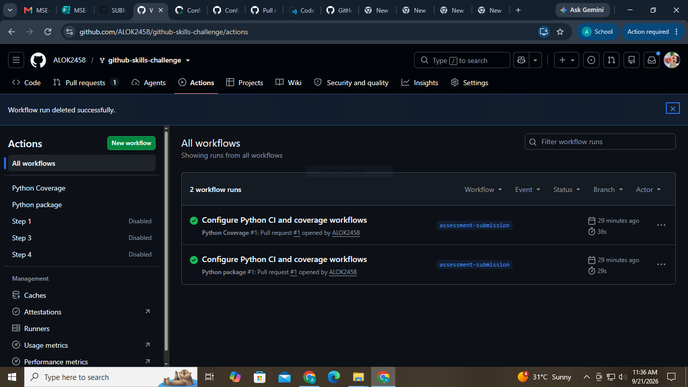

# Submission Evidence

## Repository

https://github.com/ALOK2458/github-skills-challenge

## Pull Request

https://github.com/ALOK2458/github-skills-challenge/pulls

The pull request branch is `assessment-submission`, targeting `main`.

## GitHub Actions Workflows

https://github.com/ALOK2458/github-skills-challenge/actions

Workflows:

- `Python package`
- `Python Coverage`

## Local Validation

- Tests: 15 passed
- Source coverage: 100%
- Required coverage threshold: 90%
- Python compilation: passed
- Git diff validation: passed

## Required Screenshots

Add the final screenshots to this directory before submission:

1. GitHub Actions workflows list
2. Successful test workflow execution
3. Coverage result or coverage comment on the pull request
4. Final repository and workflow files

The final evidence screenshots are included below:

